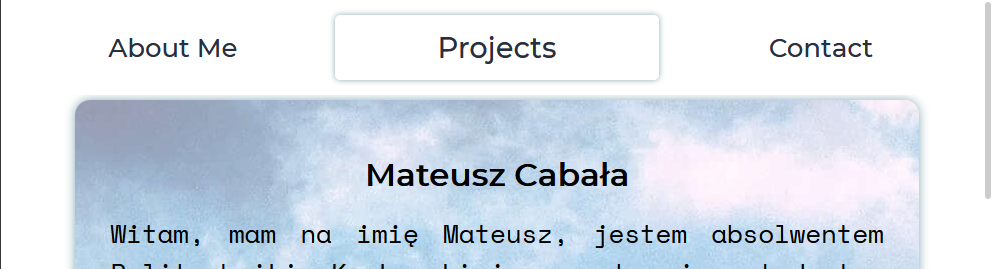
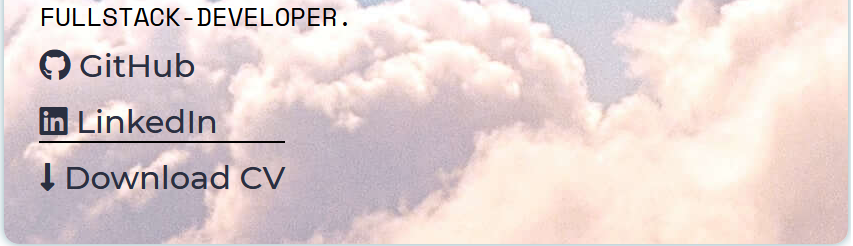
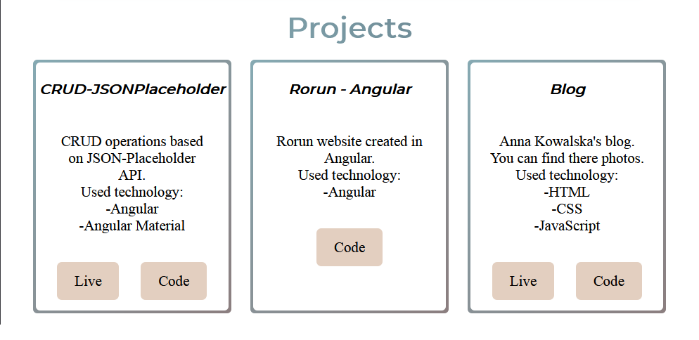
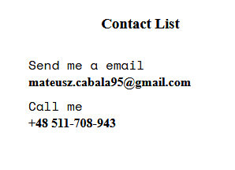

# CodersCamp 2020 - Projekt HTML & CSS
**Projekt wizytówka-portfolio** 
---
[Strona mojego portfolio](https://mateuszcabala95.github.io/CodersCamp2020.Project.HTML-CSS.BusinessCard/)
---
**Spis treści**
- [Opis Projektu](#opis-projektu)
- [Header](#header)
- [Sekcja About Me](#about-me)
- [Sekcja Projects](#projects)
- [Sekcja Contact](#contact)

## Opis projektu

Projekt portfolio-wizytówka został napisany w podejściu [Mobile First](https://solv.pl/mobile-first-dlaczego-warto-tym-wiedziec/). Oznacza to podejście projektowania strony od najmniejszej rozdzielczości (telefon) do największej (komputer PC lub telewizor). Projekt składa się z nawigacji, 3 sekcji oraz stopki. W projekcie zostały również użyte ikony ze strony [Font Awesome](https://fontawesome.com/).

Break points zostały podzielone na 
- 480px (duże telefony)
- 768px (tablety)
- 992px (tablety)
- 1200px (komputery)

## Header
W sekcji Header znajdują się dwa główne elementy: **nawigacja** oraz **ikona menu mobilnego**.  
### Menu dla urządzeń mobilnych

### Menu dla urządzeń desktopowych.

## About Me 

 W tej sekcji są podstawowe informacje na mój temat. Oprócz opisu mojej osoby znajdują się tutaj również linki do mojego Github, LinkedIn oraz możliwość pobrania mojego CV. Tutaj również dowiesz się podstawowych informacji na mój temat.
 
 
 
 ## Projects
 
 W tej sekcji przedstawiam moje dotychczasowe projekty oraz technologie, jakie zostały użyte do napisania aplikacji lub strony. W większości projektów możesz zobaczyć zarówno kod, jak i działającą aplikację. 
 
 
 
 
 ## Contact
 W sekcji Contact przedstawione są sposoby kontaktu ze mną. Przedstawiłem 3 sposoby na kontak ze mną. 
 
 - ### Formularz
 
 
 - ### Email oraz numer telefonu 
 
 
